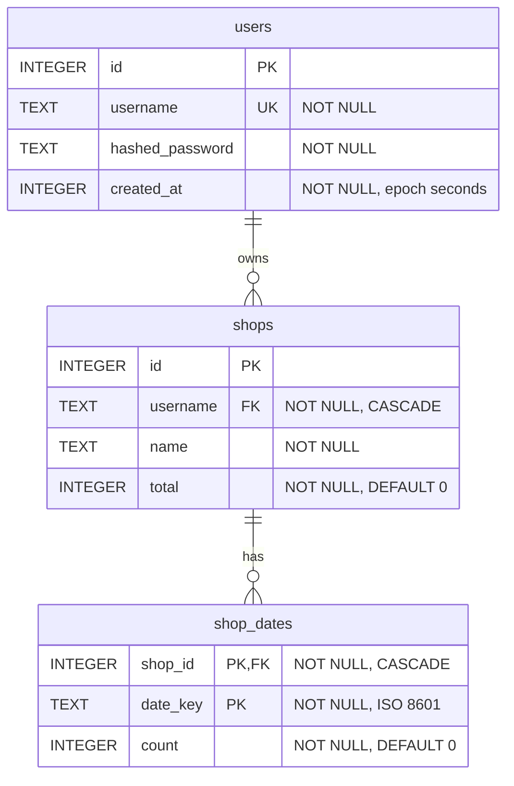

# [Boba Log](https://boba.tomthebomb.dev)

Boba Log is a Next.js app for tracking tea shop visits and drink totals, deployed to Cloudflare Workers.

## Stack

- **Framework:** Next.js 16 (App Router)
- **UI Library:** React 19
- **Language:** TypeScript 5
- **Styling:** Tailwind CSS 4
- **Runtime and Deploy:** Cloudflare Workers (OpenNext)
- **Database:** Cloudflare D1 (SQLite)
- **Object Storage:** Cloudflare R2
- **Package Manager:** Bun

### Libraries

- **Charts:** `react-chartjs-2` (with `chart.js`) for dashboard visualizations
- **Icons:** `lucide-react` for UI icons

## Setup

### Prerequisites

- Bun
- Wrangler CLI

### Install

```bash
bun install
```

### Environment

Create a `.env` file in the project root:

```env
JWT_SECRET=your-jwt-secret
R2_ACCOUNT_ID=your-cloudflare-account-id
R2_ACCESS_KEY=your-r2-access-key
R2_SECRET_ACCESS_KEY=your-r2-secret-key
R2_BUCKET_NAME=your-r2-bucket-name
```

## Development

Use `bun run preview` as the primary way to test app behavior, APIs, and Cloudflare bindings (including D1).

```bash
bun run preview
```

Use `bun run dev` for fast local UI iteration only:

```bash
bun run dev
```

`bun run dev` is useful for frontend speed, but `bun run preview` is the more accurate test path before deploying.

## Database (D1)

This project uses the `boba_log` D1 binding from `wrangler.jsonc` with database name `boba-log`.

### Create database

Create the D1 database:

```bash
bun wrangler d1 create boba-log
```

Then copy the returned `database_id` into `wrangler.jsonc` under `d1_databases[0].database_id`.

Apply schema:

```bash
bun wrangler d1 execute boba-log --remote --file=schema.sql
```

### Schema



## Default Shop Avatars

Normalize all images in `public/default-shops` to square `256x256` WebP assets:

```bash
bun run assets:normalize-default-shops
```

Supported source formats: `.jpg`, `.jpeg`, `.png`, `.webp`, `.avif`, `.tiff`.
Non-WebP source files are replaced with generated `.webp` outputs.

## Deployment

```bash
bun run deploy
```

## Scripts

- `bun run dev` — Next.js dev server
- `bun run build` — Production build
- `bun run preview` — OpenNext Cloudflare preview
- `bun run deploy` — OpenNext Cloudflare deploy
- `bun run assets:normalize-default-shops` — Normalize `public/default-shops` images to `256x256` WebP
- `bun run lint` — ESLint + Prettier check + TypeScript no-emit
- `bun run lint:fix` — ESLint fix + Prettier write + TypeScript no-emit
- `bun run format` — Prettier write
- `bun run format:check` — Prettier check
